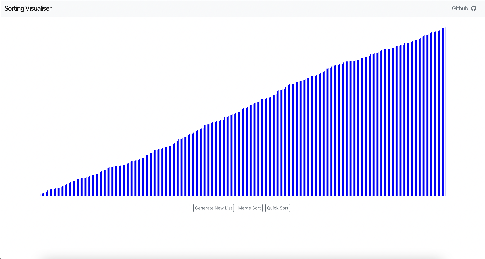
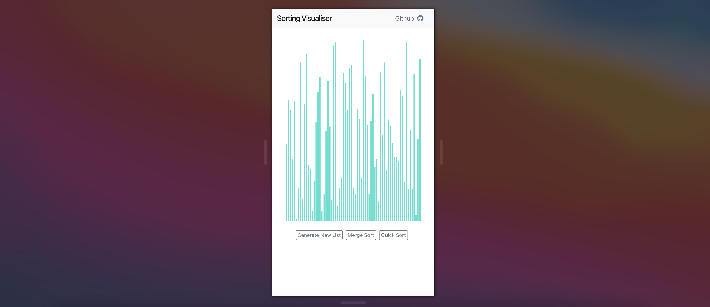

# Sorting Visualiser

## Objectives
- Implementing sorting algorithms in JavaScript
- Using hooks to manage state and lifecycle in React
- Using CSS frameworks and pre-processors to create interfaces

## Live Link
[Click here](https://react-sorting-visualiser.netlify.app/)
## Features
> A basic visualiser for sorting algorithms. It currently demonstrates the implementation of the following algorithms: Insertion Sort, Merge Sort, Quick Sort and Heap Sort. Buttons in the playground are descriptively named. Click on `Generate new list` to create a random list of unsorted bars. Clicking on either of the sorting buttons shows how these algorithms work. Hover on the sorting buttons to see a tooltip with the worst case of each algorithm.

_Sorted_

_Mobile_

## Built With
- React
- JavaScript
- npm
- SCSS

## Getting Started
- Clone this project by running `git clone git@github.com:george-swift/sorting-visualiser.git`
- Run `npm install` to install the required dependencies.
- After installing all dependencies, run `npm start` to fire up a local server with live reloading.
- If not already redirected, visit `http://localhost:3000/` in your browser to use _Sorting Visualiser_
- To terminate the server, enter `Ctrl + C` in your terminal.

## Authors

👤 &nbsp; **Ubong George**
- LinkedIn: [Ubong George](https://www.linkedin.com/in/ubong-itok)
- GitHub: [@george-swift](https://github.com/george-swift)

## Acknowledgments
- [React](https://reactjs.org/)
- [Inspiration: Clément Mihailescu](https://www.youtube.com/watch?v=pFXYym4Wbkc)

## Show your support

Leave a :star:️ &nbsp; if you like this project!

## License

Available as open source under the terms of the [MIT License](https://opensource.org/licenses/MIT).